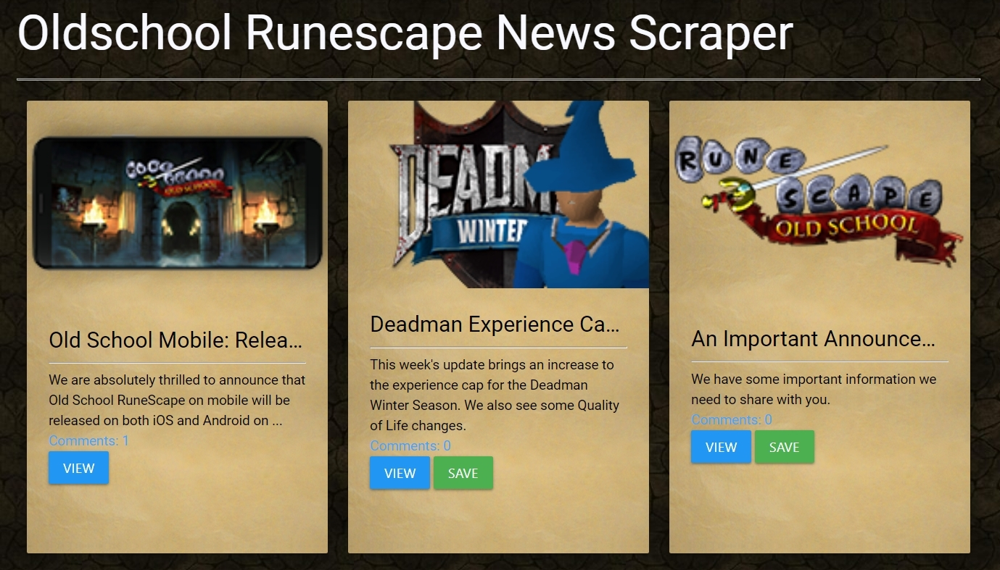

# OSRS News Scraper

OSRS News Scraper is a Full Stack Web application that uses cheerio to scrape current news articles from [Olschool Runescape](https://oldschool.runescape.com/). Users can save their favorite articles and comment on them.

### Technologies used

- Express
- Mongo DB
- Handlebars
- Cheerio
- Axios